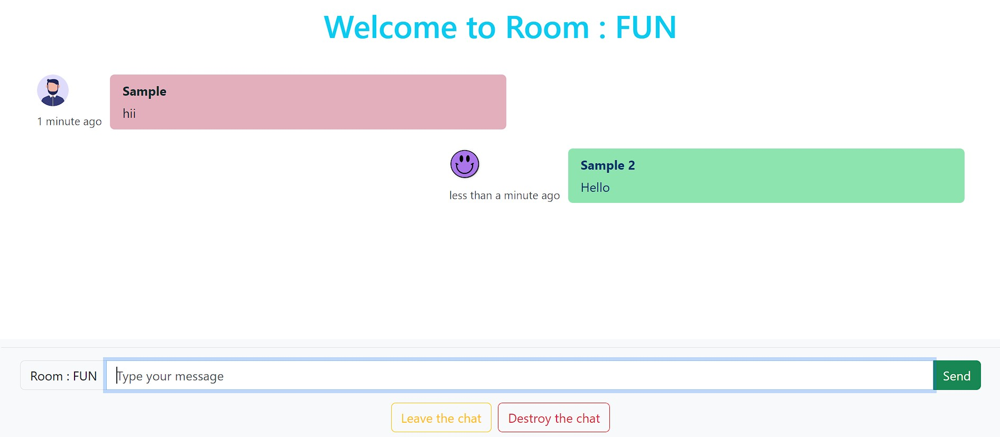

# ChatSphere

ChatSphere is a real-time chat application that enables users to have group conversations securely and efficiently. Users can create or join chat rooms, exchange messages, and connect with friends, family, or colleagues.

Visit the live app: [ChatSphere](https://chatapp-34f86.web.app/)

## Features

- Create or join chat rooms with a unique room name.
- Secure and private conversations within chat rooms.
- Real-time messaging with multiple participants.
- User-friendly interface for an intuitive chatting experience.
- Responsive design for various devices and screen sizes.

## Screenshots

## Usage

1. Visit the [ChatSphere website](https://chatapp-34f86.web.app/).
2. Enter a unique room name or join an existing room.
3. Start chatting with participants in real-time.

## Installation

You don't need to install anything to use ChatSphere. Just visit the website and start chatting!

